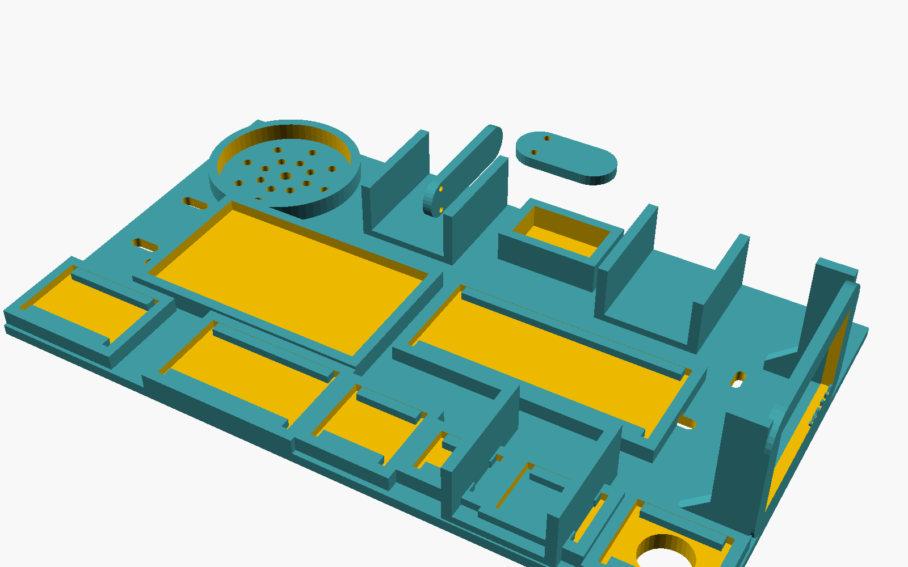
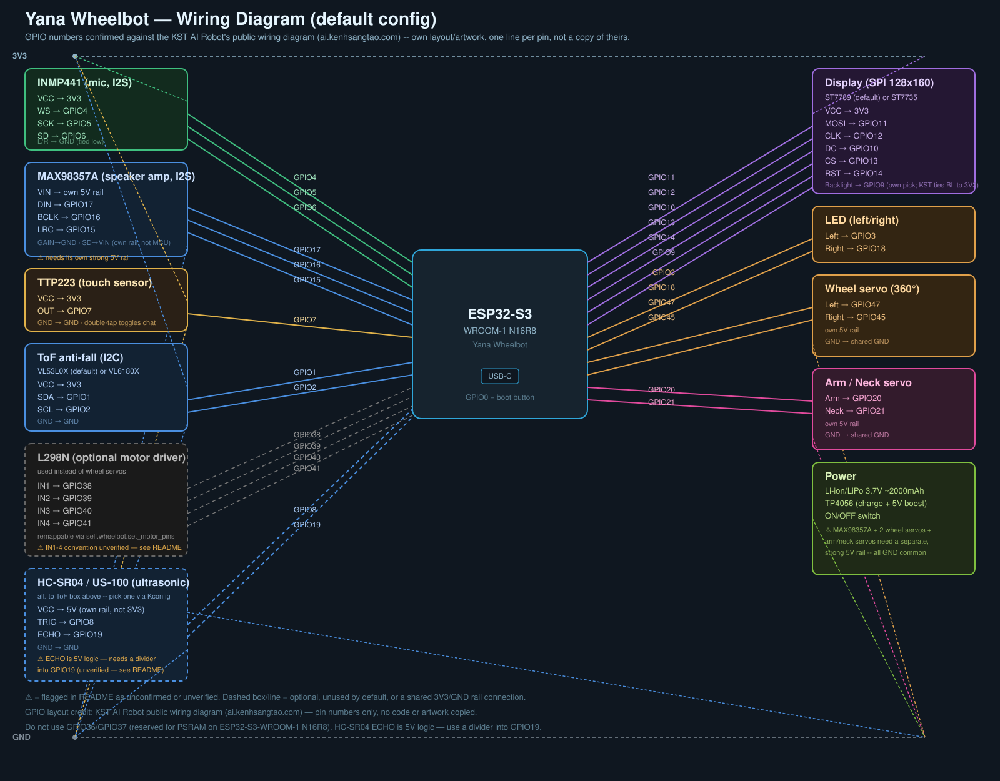

# Yana Robot

(Tiếng Việt | [English](README.md) | [한국어](README_ko.md))

Nền tảng robot voice-AI ESP32-S3: điều khiển động cơ/servo, an toàn chống
rơi, và điều khiển qua giọng nói + web dựa trên MCP, chạy trên bản fork
riêng của Yana từ nền firmware XiaoZhi AI Chatbot.

## Yana Wheelbot




- Di chuyển differential-drive, driver động cơ chọn được lúc chạy (servo
  xoay liên tục hoặc L298N DC)
- Cảm biến chống rơi VL53L0X (VL6180X là tùy chọn lúc build), có cơ chế
  khóa chặn di chuyển khi cảm biến báo không an toàn, không chỉ dừng lần
  di chuyển hiện tại
- 2 LED, servo tay + cổ, cảm biến chạm TTP223
- Đổi được hướng/theme màn hình (mặc định ST7789, ST7735 là tùy chọn build)
- Danh sách linh kiện đầy đủ, sơ đồ đấu nối, và tham khảo MCP tool:
  [main/boards/yana-wheelbot](main/boards/yana-wheelbot) ·
  [English](main/boards/yana-wheelbot/README.md) ·
  [한국어](main/boards/yana-wheelbot/README_ko.md)
- Bảng điều khiển web, đa ngôn ngữ EN/VI/KO: [apps/controller-web](apps/controller-web)
- Chassis in 3D (BOM, đấu dây, hướng dẫn lắp ráp):
  [Tiếng Việt](main/boards/yana-wheelbot/chassis/CHASSIS_GUIDE_vi.md) ·
  [English](main/boards/yana-wheelbot/chassis/CHASSIS_GUIDE.md) ·
  [한국어](main/boards/yana-wheelbot/chassis/CHASSIS_GUIDE_ko.md)

**Trạng thái thật:** `yana-wheelbot` mới chỉ build-verified — compile
sạch, chân GPIO mặc định đã đối chiếu với một thiết kế tham khảo công khai
thật, nhưng chưa có robot thật nào được lắp và chạy thử. Xem README riêng
của board để biết danh sách cụ thể những gì còn cần kiểm chứng trên phần
cứng trước khi coi là ổn.

## Điều khiển bằng điện thoại hoặc máy tính

Yana Wheelbot hiện **không** tự cung cấp trang `/robot`. Giao diện trong
[`apps/controller-web`](apps/controller-web) chạy trên máy Mac, Windows hoặc
Linux rồi kết nối trực tiếp tới robot qua cùng mạng Wi-Fi nội bộ.

### Chuẩn bị trước khi kết nối

- Nạp firmware `yana-wheelbot` và cho robot kết nối Wi-Fi 2.4 GHz.
- Máy chạy giao diện và điện thoại, nếu có, phải ở cùng mạng LAN. Không dùng
  mạng khách và phải tắt tính năng AP/client isolation.
- Tìm IP của robot trong danh sách DHCP/thiết bị của router hoặc serial log
  ESP-IDF.
- Lấy token điều khiển nội bộ gồm sáu chữ số qua một phiên voice/cloud đã
  xác thực bằng tool `self.local_control.get_token`.
- Cài Node.js 18 trở lên và npm trên máy dùng để chạy giao diện.

### Khởi động giao diện điều khiển

```sh
cd apps/controller-web
npm install                 # chỉ cần ở lần đầu
npm run dev:lan
```

Vite sẽ in ra địa chỉ **Local** và **Network**:

| Thiết bị mở giao diện | Địa chỉ cần mở |
|---|---|
| Trình duyệt trên chính máy đang chạy giao diện | `http://localhost:5173` |
| iPhone, Android hoặc máy tính khác | địa chỉ Network, ví dụ `http://192.168.1.20:5173` |

`localhost` trên điện thoại là chính điện thoại đó, không phải máy tính đang
chạy giao diện. Hãy cho phép truy cập mạng nội bộ/tường lửa khi macOS hoặc
Windows hỏi.

Trong trang Yana Wheelbot, nhập:

- **Device URL:** `ws://<IP-robot>:8080/ws`
- **Pairing token:** token sáu chữ số đã lấy ở trên

Trang web sẽ tự nối `?token=<mã>` vào URL bắt tay WebSocket. Bấm **Kết nối**,
nâng bánh xe khỏi mặt đất ở lần thử đầu, kiểm tra nút **STOP**, rồi mới thử
chạy dưới sàn. Lệnh di chuyển dùng các xung an toàn ngắn được gia hạn liên
tục; thả nút, mất focus trình duyệt hoặc mất kết nối sẽ dừng động cơ.

### Xử lý lỗi kết nối

- **Không mở được địa chỉ Network:** dùng `npm run dev:lan`, kiểm tra tường
  lửa máy chủ và bảo đảm hai thiết bị cùng mạng Wi-Fi không phải mạng khách.
- **Mở được trang nhưng không nối được robot:** kiểm tra IP robot, cổng
  `8080`, token và AP/client isolation.
- **HTTP 401 hoặc WebSocket ngắt ngay:** token thiếu hoặc sai. Lấy lại token;
  nếu nghi bị lộ, đổi bằng `self.local_control.rotate_token`.
- **Trang chạy bằng HTTPS không mở được `ws://`:** trình duyệt chặn mixed
  content. Hãy chạy HTTP nội bộ như lệnh trên; firmware hiện chưa có `wss://`.
- Không mở port `8080` ra Internet bằng port forwarding. Kết nối nội bộ có
  token nhưng chưa mã hóa, chỉ nên dùng trong LAN đáng tin cậy.

### Tình trạng tương thích giao thức

Đối chiếu mã nguồn cho thấy toàn bộ 25 tên MCP tool và kiểu tham số giao diện
web sử dụng đều khớp với phần đăng ký tool trong firmware. URL bắt tay là
`ws://<IP-robot>:8080/ws?token=<mã>`; frame text dùng JSON-RPC 2.0, phiên bản
MCP `2024-11-05`, với ba method `initialize`, `tools/list` và `tools/call`.

Đây là tập con JSON-RPC tương thích MCP của firmware, chưa phải một transport
MCP đa dụng hoàn chỉnh. Response hiện được phát tới mọi local client đã xác
thực, vì vậy chỉ nên mở một bảng điều khiển nội bộ tại một thời điểm để tránh
trùng request ID. Lệnh voice và lệnh local cũng có thể chồng nhau; lệnh di
chuyển mới nhất sẽ thắng. Các đường này đã được kiểm tra ở mức mã nguồn/build
nhưng vẫn cần test end-to-end trên robot thật.

## Yêu cầu

- ESP-IDF v6.0 trở lên; v6.0.2 là SDK ổn định được khuyến nghị. Xem
  [ESP-IDF 6.0 Migration Guide](docs/esp-idf-6-migration.md) để biết chi
  tiết tương thích.
- Cursor hoặc VS Code với plugin ESP-IDF. Linux build nhanh hơn và ít lỗi
  driver hơn Windows.
- Dự án này theo chuẩn code style C++ của Google.

## Tài liệu

- [Board Yana Wheelbot](main/boards/yana-wheelbot) — linh kiện, đấu nối, MCP tool
- [Bảng điều khiển web Wheelbot](apps/controller-web) — control panel trên trình duyệt
- [Custom Board Guide](docs/custom-board.md) — hướng dẫn tạo board mới
- [MCP Protocol IoT Control Usage](docs/mcp-usage.md)
- [MCP Protocol Interaction Flow](docs/mcp-protocol.md)
- [Giao thức WebSocket](docs/websocket.md) · [Giao thức MQTT + UDP](docs/mqtt-udp.md)
- [Phần cứng được hỗ trợ](docs/supported-boards.md)
- [ESP-IDF 6.0 Migration Guide](docs/esp-idf-6-migration.md)

Firmware kết nối tới server chính thức [xiaozhi.me](https://xiaozhi.me) theo
mặc định nếu anh không trỏ nó sang backend riêng — người dùng cá nhân có
thể đăng ký tài khoản ở đó miễn phí.

## Giấy phép và nguồn gốc

Yana Robot phát hành theo giấy phép MIT — dùng miễn phí, kể cả cho mục
đích thương mại. Dự án được xây dựng trên nền
[XiaoZhi AI Chatbot](https://github.com/78/xiaozhi-esp32) (cũng MIT), do
Xiaoqiang ([78](https://github.com/78)) và Shenzhen Xinzhi Future
Technology Co., Ltd. tạo ra; file LICENSE giữ nguyên thông báo bản quyền
gốc của họ theo đúng yêu cầu giấy phép. Repo này là một nhánh phát triển
độc lập, không liên kết hay đồng bộ với dự án gốc — xem
[docs/origin-story_vi.md](docs/origin-story_vi.md) để đọc đầy đủ phần nào
kế thừa, phần nào tự xây mới.

Nếu anh có ý tưởng hay đề xuất gì, hãy mở Issue trên repo này.
