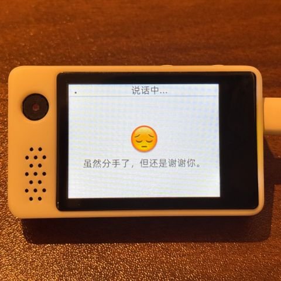
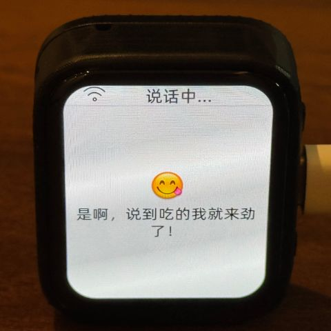

# Supported Hardware

Inherited from the upstream [XiaoZhi AI Chatbot](https://github.com/78/xiaozhi-esp32)
project: 138 board directories, 171 release variants, across ESP32,
ESP32-C3, ESP32-C5, ESP32-C6, ESP32-S3, and ESP32-P4. These are not actively
developed by Yana Robot going forward (see the root README's "Origin"
section) but remain buildable and are kept working as the SDK moves
forward — see the [ESP-IDF 6.0 Migration Guide](esp-idf-6-migration.md) for
current compatibility status.

The one board actively developed under the Yana Robot name is
[`yana-wheelbot`](../main/boards/yana-wheelbot) — see the root README.

## A partial list of inherited boards

- <a href="https://oshwhub.com/li-chuang-kai-fa-ban/li-chuang-shi-zhan-pai-esp32-s3-kai-fa-ban" target="_blank" title="LiChuang ESP32-S3 Development Board">LiChuang ESP32-S3 Development Board</a>
- <a href="https://github.com/espressif/esp-box" target="_blank" title="Espressif ESP32-S3-BOX-3">Espressif ESP32-S3-BOX-3</a>
- <a href="https://docs.m5stack.com/zh_CN/core/CoreS3" target="_blank" title="M5Stack CoreS3">M5Stack CoreS3</a>
- <a href="https://docs.m5stack.com/en/atom/Atomic%20Echo%20Base" target="_blank" title="AtomS3R + Echo Base">M5Stack AtomS3R + Echo Base</a>
- <a href="https://gf.bilibili.com/item/detail/1108782064" target="_blank" title="Magic Button 2.4">Magic Button 2.4</a>
- <a href="https://www.waveshare.net/shop/ESP32-S3-Touch-AMOLED-1.8.htm" target="_blank" title="Waveshare ESP32-S3-Touch-AMOLED-1.8">Waveshare ESP32-S3-Touch-AMOLED-1.8</a>
- <a href="https://github.com/Xinyuan-LilyGO/T-Circle-S3" target="_blank" title="LILYGO T-Circle-S3">LILYGO T-Circle-S3</a>
- <a href="https://oshwhub.com/tenclass01/xmini_c3" target="_blank" title="XiaGe Mini C3">XiaGe Mini C3</a>
- <a href="https://oshwhub.com/movecall/cuican-ai-pendant-lights-up-y" target="_blank" title="Movecall CuiCan ESP32S3">CuiCan AI Pendant</a>
- <a href="https://github.com/WMnologo/xingzhi-ai" target="_blank" title="WMnologo-Xingzhi-1.54">WMnologo-Xingzhi-1.54TFT</a>
- <a href="https://www.seeedstudio.com/SenseCAP-Watcher-W1-A-p-5979.html" target="_blank" title="SenseCAP Watcher">SenseCAP Watcher</a>
- <a href="https://www.bilibili.com/video/BV1BHJtz6E2S/" target="_blank" title="ESP-HI Low Cost Robot Dog">ESP-HI Low Cost Robot Dog</a>

  
  
  
  
  
  
  
  
  
  
  
  

## Inherited platform capabilities

- Wi-Fi, wired Ethernet, USB RNDIS, and ML307/EC801E or NT26 Cat.1 4G networking; supported boards can switch between Wi-Fi and 4G
- Offline voice wake-up with [ESP-SR](https://github.com/espressif/esp-sr), including customizable wake words
- Two communication transports: [WebSocket](websocket.md) and [MQTT + UDP](mqtt-udp.md)
- Opus audio streaming with conventional streaming ASR + LLM + TTS pipelines and Realtime end-to-end voice models; AEC-capable hardware supports realtime full-duplex interaction
- Speaker recognition via [3D Speaker](https://github.com/modelscope/3D-Speaker)
- OLED / LCD displays with emoji and rich expression support, plus camera vision input on supported boards
- Battery display and power management
- 39 interface languages, with localized voice prompts where available and English fallback
- Wi-Fi provisioning through hotspot or BluFi
- Device-side MCP for device control (Speaker, LED, Servo, GPIO, etc.) and cloud-side MCP to extend large model capabilities (smart home control, PC desktop operation, knowledge search, email, etc.)
- Customizable wake words, fonts, emojis, and chat backgrounds via the [Custom Assets Generator](https://github.com/78/xiaozhi-assets-generator)

## Compatible ecosystem

The firmware speaks the XiaoZhi communication protocol. Third-party servers
and clients built for that protocol also work here:

Servers:
- [xinnan-tech/xiaozhi-esp32-server](https://github.com/xinnan-tech/xiaozhi-esp32-server) (Python)
- [joey-zhou/xiaozhi-esp32-server-java](https://github.com/joey-zhou/xiaozhi-esp32-server-java) (Java)
- [AnimeAIChat/xiaozhi-server-go](https://github.com/AnimeAIChat/xiaozhi-server-go) (Go)
- [hackers365/xiaozhi-esp32-server-golang](https://github.com/hackers365/xiaozhi-esp32-server-golang) (Go)

Clients:
- [huangjunsen0406/py-xiaozhi](https://github.com/huangjunsen0406/py-xiaozhi) (Python)
- [TOM88812/xiaozhi-android-client](https://github.com/TOM88812/xiaozhi-android-client) (Android)
- [100askTeam/xiaozhi-linux](http://github.com/100askTeam/xiaozhi-linux) (Linux, by 100ask)
- [78/xiaozhi-sf32](https://github.com/78/xiaozhi-sf32) (Bluetooth chip firmware, by Sichuan)
- [QuecPython/solution-xiaozhiAI](https://github.com/QuecPython/solution-xiaozhiAI) (QuecPython, by Quectel)
